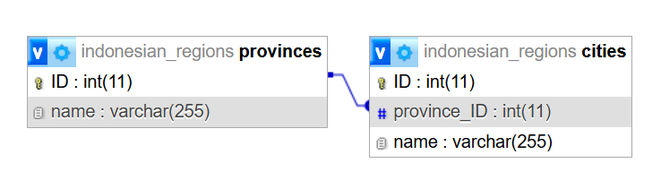

# Orbit Open Recruitment!

Merupakan Github Repository untuk menyimpan dan memenuhi keperluan [Modul Praktikum Composite Attribute & jQuery 2025](https://docs.google.com/document/d/1vAzUaWbqJkAABZjvc6J6DLgdpgpiHbGAnGLzbzCRpjU/edit).

## Database
### [Indonesian Provinces and Cities/Regencies](https://github.com/codewara/indonesian_regions)

## Program
index.php       : Berisikan halaman untuk autentikasi user dengan register dan login form

migrate.php     : membuat ulang database tanpa melakukan import secara manual.

auth.php        : mengarahkan untuk meng-handle data auth dari index.php